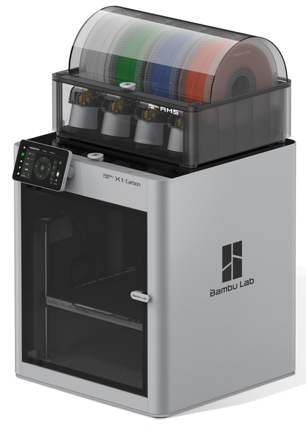
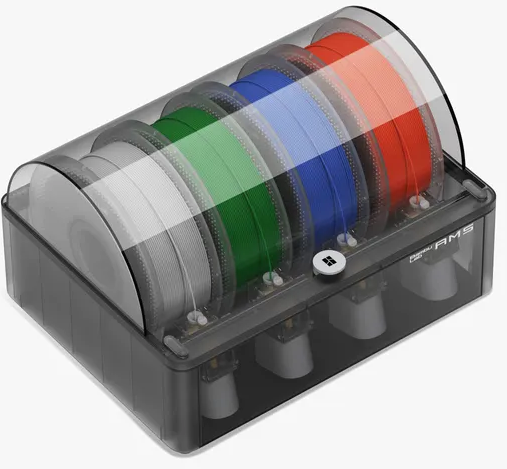
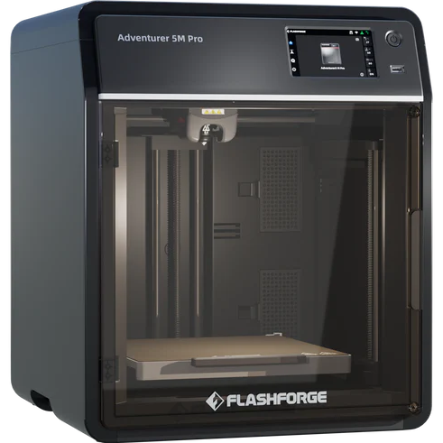

# Machine Details

The Hacklab has three separate 3D Printers (yes, _three_).

There is a BambuLabs X1 Carbon (with the 'AMS' unit), and there are 2 FlashForge Adventurer 5M Pro units.

## Specs

Each of the machines behaves a little differently - and the Bambu unit has an extra capability that the FlashForges do not (quickly switching filaments mid-job).  

### BambuLabs X1 Carbon

{ loading=lazy }

| Spec | Value |
| --- | --- |
| Build Width | 256mm |
| Build Depth | 256mm |
| Build Height | 256mm |
| Build Plate | Enclosed, Heated |
| Extruder Temperature | <300°C |
| Nozzle Diameter | 0.4mm |
| Compatible Slicing Software | Bambu Studio Support third party slicers which export standard G-code such as Superslicer, Prusaslicer and Cura, but certain advanced features may not be supported. |
| Filaments |  PLA, PETG, TPU, ABS, ASA, PVA, PET, PA, PC Carbon / Glass Fibre Reinforced Polymer _Note that Carbon and Fibreglass will cause extra wear on the print nozzle_.|

#### AMS

{ loading=lazy }

The 'Bambu Lab Automatic Material System' allows you to load several different filaments in for use in a single print job.  
This could be multiple colours or multiple materials, or multiple partial rolls of filament for the printer to automatically change rolls when what's left on a roll runs out.  
The AMS also senses when filament tangles or fails to feed, which stops printing to help reduce failed prints - which also reduces wastage. 

**_Why would this be useful, beyond pretty colours?_**  
If you are doing a complex print that requires _supports_ to be used, then you could have the print use a whole separate colour for the support structures - which will make identifying when all the supports have been cut away that much easier.

### FlashForge Adventurer 5M Pro

{ loading=lazy }

| Spec | Value |
| --- | --- |
| Build Width | 220mm |
| Build Depth | 220mm |
| Build Height | 220mm |
| Build Plate | Enclosed |
| Extruder Temperature | 280°C |
| Nozzle Diameter | 0.4mm |
| Compatible Slicing Software | FlashPrint 5 Orca-Flashforge Orca Slicer |
| Filaments | PLA/PETG (0.4mm nozzle) ABS/ASA TPU/PLA-CF/PETG-CF (0.6/0.8mm nozzle) |
