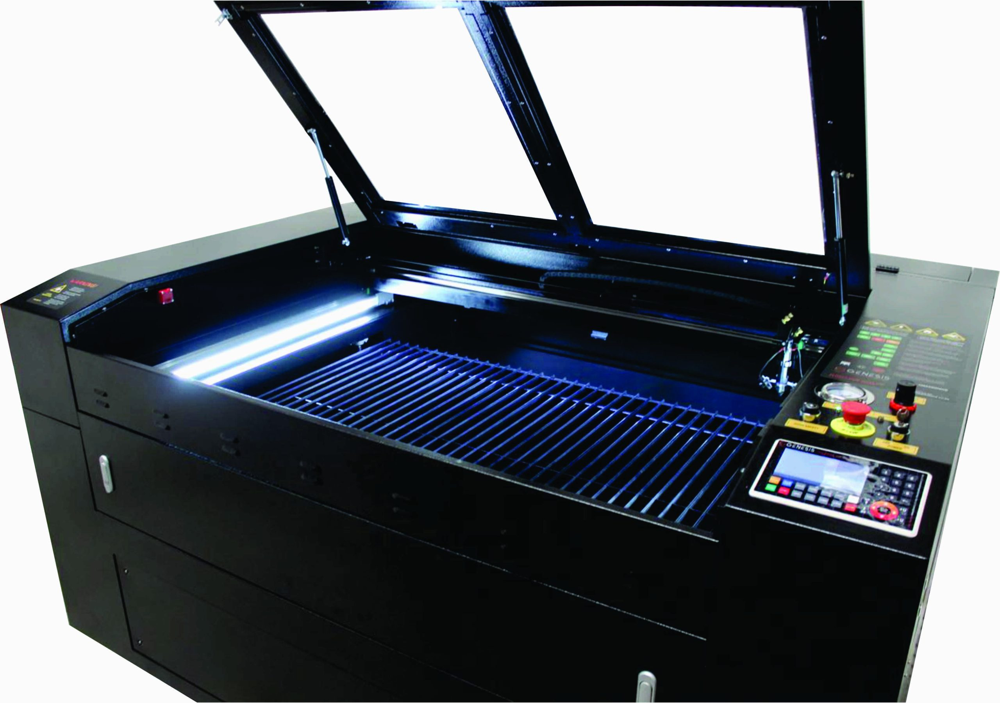

# Machine Details

{ loading=lazy }

## Machine Model

The laser cutter/engraver that the HackLab has is the G139L "Genesis", by MakerSpace.  
It's a fully-enclosed laser cutter and engraver.  
It has been connected to the G150FE Genesis Fume Extractor (to protect our lungs and the air quality around us).

## Bed Details

The workbed (where the material you are working with goes) is able to accommodate sheets of material up to 1300 x 900 millimetres in size.
The maximum thickness of the material is 450mm - but this is only for engraving, not for cutting.  
For reliable cutting, the maximum material thickness is 16mm MDF or 18mm pine. With the 100W tube, the machine _can_ do 18mm MDF and 20mm pine, but it's advisable to err on the side of caution - multiple partial cut passes with a delay between them will produce a better result than one high-power full cut run (as it will burn/singe the surrounding material less).